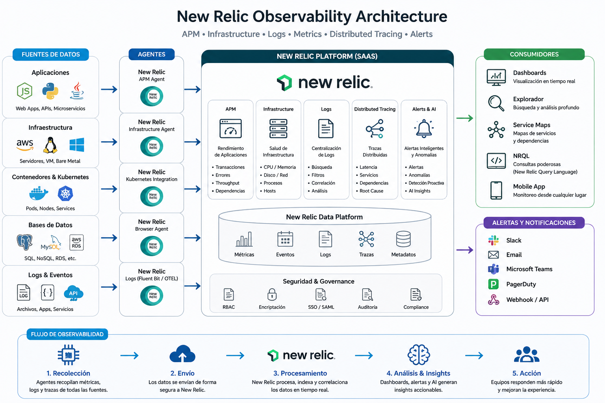

# 📊 Observabilidad con New Relic (APM, Logs, Metrics & Tracing)

Implementación de una plataforma completa de observabilidad utilizando New Relic para monitoreo de aplicaciones, infraestructura y sistemas distribuidos.

---

# 🧠 Objetivo

Centralizar la visibilidad de:

- Aplicaciones (APM)
- Infraestructura
- Logs
- Métricas
- Trazas distribuidas

Con enfoque en:

✔ Detección temprana de fallos  
✔ Análisis de rendimiento  
✔ Troubleshooting en tiempo real  
✔ Observabilidad end-to-end  

---

# 🏗 Arquitectura de Observabilidad

<p align="center">
  
</p>

---

# 🔧 Componentes Clave

## 🔹 APM (Application Performance Monitoring)

Monitoreo profundo de aplicaciones:

- Tiempo de respuesta  
- Throughput (requests por segundo)  
- Errores  
- Dependencias externas  

### 🎯 Beneficios

✔ Identificación de cuellos de botella  
✔ Trazabilidad de requests  
✔ Visibilidad por endpoint  

---

## 🔹 Infraestructura Monitoring

Monitoreo de servidores y contenedores:

- CPU, RAM, Disk  
- Network  
- Procesos  

✔ Integración con Kubernetes  
✔ Monitoreo de nodos y pods  

---

## 🔹 Logs (Centralización)

- Recolección de logs en tiempo real  
- Búsqueda avanzada  
- Correlación con APM  

✔ Debug más rápido  
✔ Visibilidad completa  

---

## 🔹 Distributed Tracing

Seguimiento de requests entre microservicios:

- Latencia entre servicios  
- Dependencias  
- Root cause analysis  

✔ Ideal para arquitecturas microservicios  

---

## 🔹 Alerts & AI (Proactive Monitoring)

- Alertas basadas en métricas  
- Detección de anomalías  
- Integración con Slack / Email  

✔ Prevención de incidentes  
✔ Respuesta rápida  

---

# ☸️ Integración con Kubernetes

New Relic permite monitorear clusters Kubernetes:

- Pods  
- Nodes  
- Namespaces  
- Workloads  

✔ Visualización completa del cluster  
✔ Métricas en tiempo real  

---

# ⚙️ Instalación Básica

## 🔹 1. Crear cuenta en New Relic

https://newrelic.com

---

## 🔹 2. Instalar agente (Infraestructura)

```bash
curl -Ls https://download.newrelic.com/install/newrelic-cli/scripts/install.sh | bash
```

---

## 🔹 3. Configurar licencia

```bash
export NEW_RELIC_LICENSE_KEY="TU_LICENSE_KEY"
```

---

## 🔹 4. Instrumentar aplicación (Ejemplo Python)

```bash
pip install newrelic
```

Configurar:

```bash
newrelic-admin generate-config YOUR_LICENSE_KEY newrelic.ini
```

Ejecutar app:

```bash
newrelic-admin run-program python app.py
```

---

# 📊 Dashboards

New Relic permite crear dashboards personalizados:

✔ Métricas de aplicación  
✔ Infraestructura  
✔ Logs  
✔ KPIs  

---

# 🚨 Alertas

Ejemplo de alertas:

- CPU > 80%  
- Error rate alto  
- Latencia elevada  

✔ Notificaciones en tiempo real  

---

# 🎯 Casos de Uso

✔ Monitoreo de APIs  
✔ Microservicios  
✔ Kubernetes  
✔ Sistemas distribuidos  
✔ CI/CD observability  

---

# 📈 Beneficios

- Reducción de MTTR  
- Visibilidad completa del sistema  
- Mejor performance de aplicaciones  
- Detección proactiva de errores  

---

# 🚀 Conclusión

New Relic permite implementar observabilidad moderna con un enfoque:

✔ Cloud-native  
✔ Escalable  
✔ Basado en datos  

Ideal para arquitecturas distribuidas y entornos productivos.

---
